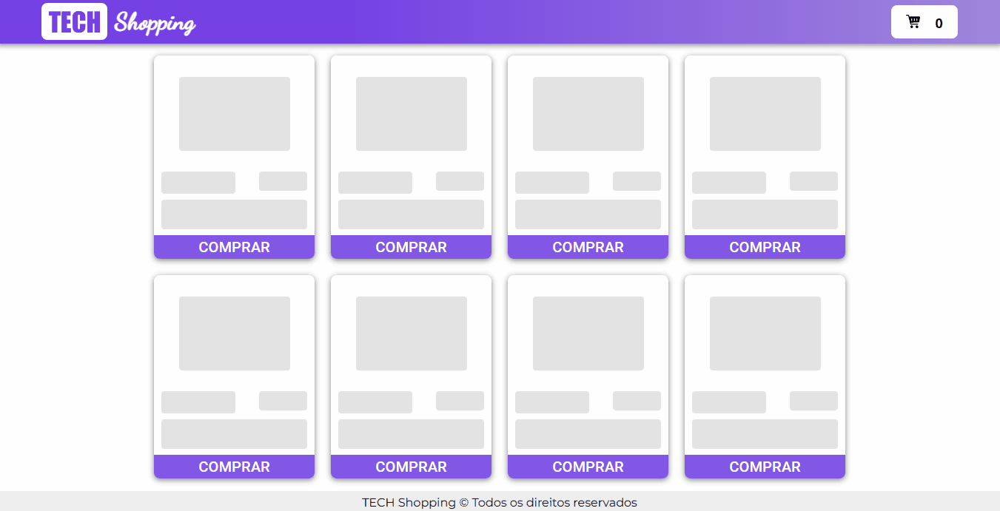

<h1 align="center">
  
 Tech Shopping
</h1>

Todos os seus gadgets favoritos em um só lugar.

 <a href="#Descrição">Descrição</a> •
 <a href="#Tecnologias">Tecnologias utilizadas</a> •
 <a href="#autor">Autor</a>

---

 

<h1 align="center">  
  

    
    
  

</h1>

### Descrição

Projeto full stack com Front feito com React JS e typescript e backend feito com NodeJS e Express.

### Tecnologias utilizadas

As seguintes ferramentas foram usadas na construção do projeto:

- React JS
- Typescript
- Redux toolkit
- Redux Thunk
- Axios
- Styled Components
- Material UI
- Toastify
- React Router Dom

---

### Autor

Made with 💜 by Renan Cesar 👋

